# WEB数据库期末大作业
#### 2017计算机一班蔡睿、2017计算机二班张心宇
##### 2019-2020秋季学期 WEB数据库技术 课程号：2043183 课序号：1
[](https://www.apachefriends.org/index.html)  [](https://github.com/RayChromium/LZU-WEB-PHP/blob/master/LICENCE)
## 作业要求
- 用户功能模块
  - [x] 用户可以注册、登陆。用户可以添加修改自己的个人信息（性别、年龄、电话（必填）、QQ号、email），登陆界面允许用户保存用户名
  - [x] 用户浏览页面：用户登陆后可以查看推荐微博，未登录用户不可以浏览
  - [x] 用户可以浏览其他用户信息
  - [ ] 鼠标移到用户名称上能看到该用户的信息（用户名，简介，微博发布条数等）
  - [x] 微博浏览页面：点击用户能进入该用户微博页面，用户能看到该用户发布的所有微博
  - [x] 我的微博页面：用户能够看到自己发布的微博，能够对自己发布的微博进行修改
- 微博发布部分
  - [x] 发布微博
  - [x] 微博基本信息：发布内容、发布时间、发布地址
  - [x] 微博管理：浏览、添加、修改、删除微博
- 系统管理部分
  - [x] 用户管理：系统管理员能够浏览、删除用户
  - [x] 微博管理：系统管理员能够浏览、删除微博、设置推荐微博

## 安装
### 安装到自己的机器上进行测试的方法：
**由于本项目使用[](https://www.apachefriends.org/index.html)进行运行测试，建议安装`XAMPP`后使用。以下安装步骤默认用户已安装`XAMPP`与`Git`**
  
1. 进入`XAMPP`安装目录下的`htdocs`文件夹： `cd $(InstallDirectory)/xampp/htdocs`
2. 将本仓库内容`clone`到此目录下： `git clone https://github.com/RayChromium/LZU-WEB-PHP.git` 。(p.s. 如果没有安装`Git`，也可以点击右上方的`clone or download`,选择下载`.zip`压缩包解压后放入`htdocs`)
3. 开启`XAMPP`，启用`Apache`与`MySQL`
4. 打开浏览器，在地址栏输入`localhost/LZU-WEB-PHP/src/login`即可使用
5. (可选)本仓库的目录结构如下：  
   ```tree
     LZU-WEB-PHP  
    ├── LICENCE  
    ├── LICENCE_CN  
    ├── README.md  
    ├── import  
    │    └── mydb.sql  
    └── src  
        ├── addAdmin.php  
        ├── addRecommend.php  
        ├── adminShow.php  
        ├── adminUserManage.php  
        ├── conn.php  
        ├── del.php  
        ├── edit.php  
        ├── login.php  
        ├── recive.php  
        ├── removeAdmin.php  
        ├── removeRecommend.php  
        ├── show.php  
        ├── signup1.php  
        ├── userDel.php  
        └── welcome.php  
      2 directories, 19 files  
   ```
   如果需要导入仓库原有的数据，可以在`localhost/phpmyadmin`中创建数据库`mydb`并使用本仓库中的`/import/mydb.sql`
## 开发过程
### 开发环境及工具
- `Windows 7`
- `Xampp v7.13.2`
- `Visual Studio Code` with Plugins：
  - [`GITLENS`](https://marketplace.visualstudio.com/items?itemName=eamodio.gitlens)
  - [`PHP Intelephense`](https://marketplace.visualstudio.com/items?itemName=bmewburn.vscode-intelephense-client)
  - [`Markdown All in One`](https://marketplace.visualstudio.com/items?itemName=yzhang.markdown-all-in-one)
  - [`Markdown Preview Github Styling`](https://marketplace.visualstudio.com/items?itemName=bierner.markdown-preview-github-styles)
  

### 迭代过程

#### Commits on Dec 10, 2019 
分析了这个微博工具的逻辑
  
#### Commits on Dec 11, 2019 
> 添加了基本的普通用户发布、搜索、管理留言的功能

> **注册页面进行了用户输入限制（必填属性以及内容检查）**

> **注册页面根据用户填入的电话发送验证码**

> 普通用户的功能：
> 1. 查看、发布、搜索帖子。可以对自己的帖子进行修改和删除
> 2. 选择“查看推荐内容”、“查看全部内容”以及“查看自己发布的内容”
> 3. 点击某个帖子现实的用户Nickname即可查看此特定用户发布的内容

> 管理员的功能：
> 1. 查看、发布、搜索帖子。可以对自己的帖子进行修改和删除
> 2. 将某个帖子设置或移出推荐
> 3. 删除用户
> 4. 将普通用户设置为管理员 或 将管理员变为普通用户
  
本次测试发现的问题：
1. 分页（阿拉伯数字）超链接有问题
2. 页面切换链接（首尾上下页）超链接有问题。1和2需要根据用户所处的状态是`查看自己的帖子`、`搜索帖子`、`查看特定用户内容`以及`查看全部帖子`做类似的处理
3. 用户发布Post之后**跳转到查看自己的帖子的页面**
4. 管理员**不应该能够对自己的权限进行修改，也不该允许删除自己**
5. 管理员不应再拥有发布帖子的能力，应只保留其管理内容和用户的权限
6. 理论上应该确保管理员**虽然能够查看用户发布的内容，但不能进行篡改**
#### Commits on Dec 12, 2019 
> 1. 删除了用户表中的Author字段，只需要Nickname
> 2. 注册页面调用阿里云API，发送短信验证码

#### Commits on Dec 13, 2019
> 1. 管理员登录后不再显示查看自己发布内容的链接
> 2. 删除管理员的发布帖子功能

本次测试发现的问题：
1. 普通用户登录后，若不在`search`栏填入内容就点击搜索会发生逻辑错误：无论之前处于何种浏览状态都会跳转到推荐页面

待添加特性：
1. 用户进行对内容的Edit或者Delete之后应该要能够返回之前浏览的位置
2. 管理员进行管理之后同样需要自动跳转回原浏览位置
  
#### Commits on Dec 15, 2019 
> 1. 添加特性 ：用户管理发布内容后自动返回原位置
> 2. 添加特性 ：管理员管理内容后自动返回原位置
> 3. 添加[`Anti-996(反996)`开源协议](https://github.com/RayChromium/LZU-WEB-PHP/blob/master/LICENCE)

待添加特性：**当用户发布帖子时记录其IP地址，并通过第三方的API将其转换为用户所在的真实世界地址**

#### Commits on Dec 16, 2019 
> 1. **调用来自`api.ipstack.com`的地址查询API，在用户发布帖子时记录并显示其真实地址**
> 2. 完善了网页排版

### 具体的版本及分支间差异
详情见[*commit logs*](https://github.com/RayChromium/LZU-WEB-PHP/commits/Presentation)
  
## 项目及功能描述
### 使用指南
#### 账号注册
1. 进入[微博服务器登陆页面](http://bbs.zxy.ac.cn/bbs/login.php)
2. 点击Sign Up链接，进入注册页面
   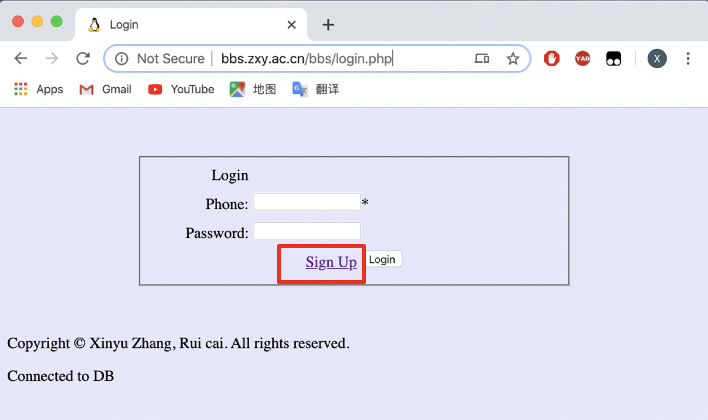
3.	进入注册页面后，首先填写真实手机号，目前仅支持中国大陆11位手机号，最多输入11位。点击sent按钮发送短信验证码。（发验证码会收费，仅供测试）
  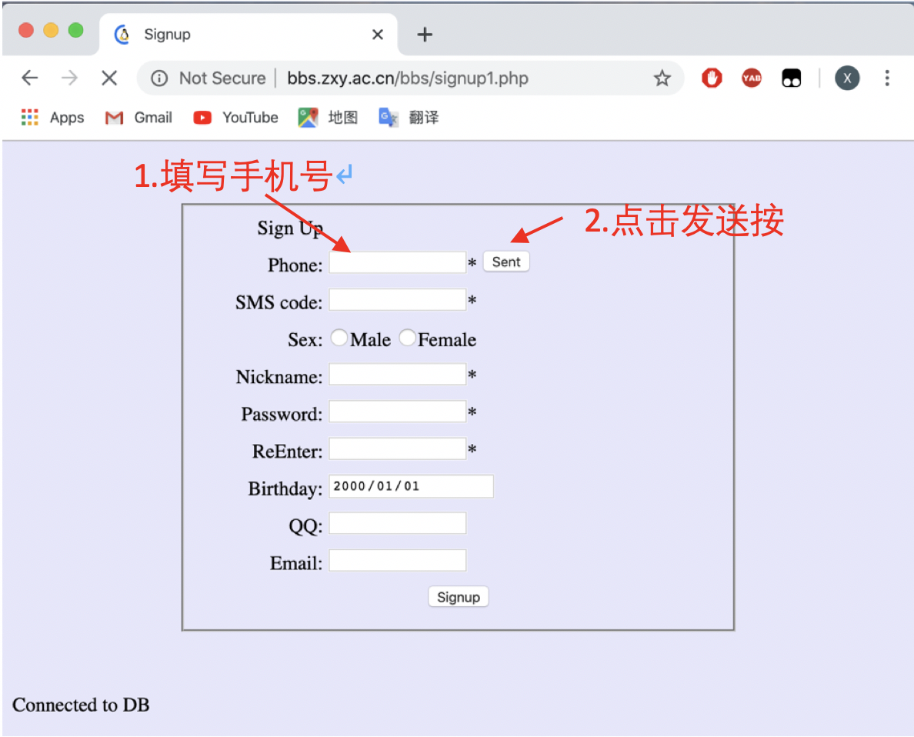
  如果输入的手机号不正确会提示发送失败
  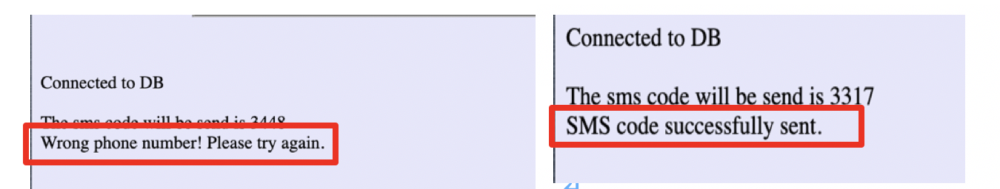
  如果输入的手机号正确会提示发送成功
4.	输入向手机发送的验证码，填入SMS code中，并填写下列的表单:
  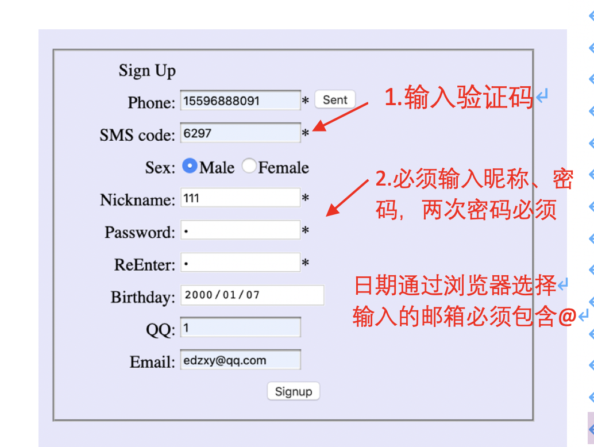
  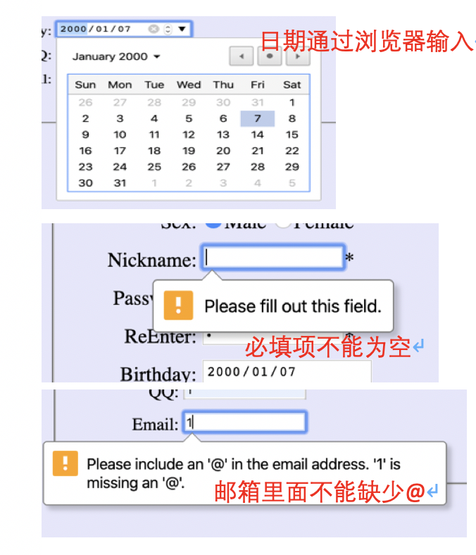
  如果输入的验证码不正确会提示错误:
  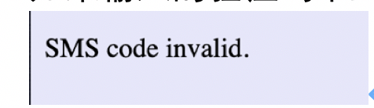
  如果输入的验证码正确，但已经数据可有该手机号，会提示手机号已注册:
  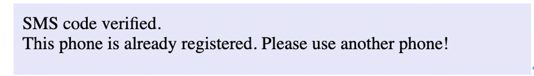
  如果输入的验证码、表单输入正确，且手机号未注册，会完成注册。点击Back to login返回登陆界面:
  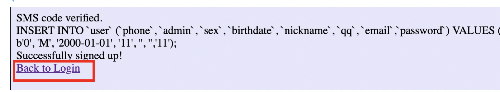
  
#### 用户登陆
1. 无论管理员还是普通用户，输入手机号，密码完成登陆
  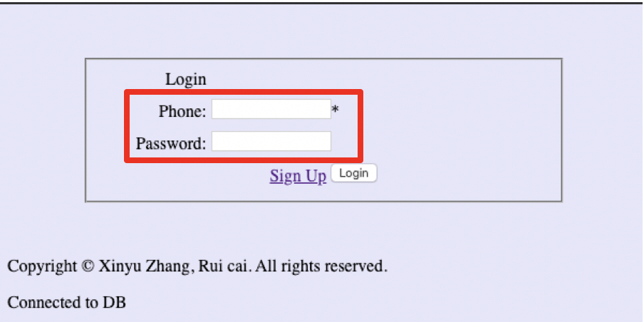
  如果输入的手机号在数据库中不存在，会提示该手机号未注册:
  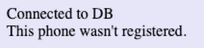
  如果输入的手机号和密码与数据库不符，会提示密码错误:
  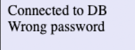
2. 手机号与密码正确会完成跳转，管理员会跳转到adminShow.php，普通用户会跳转到show.php:
   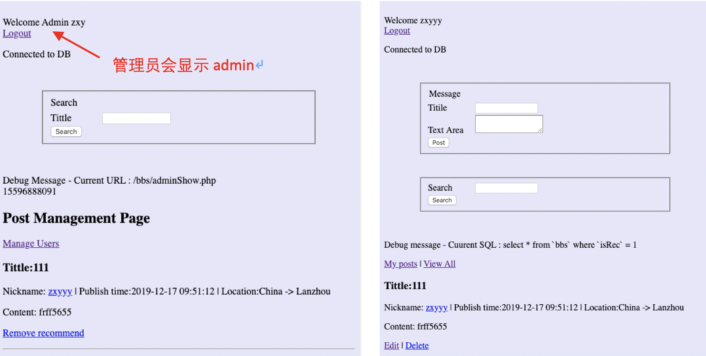
3. 退出登陆
   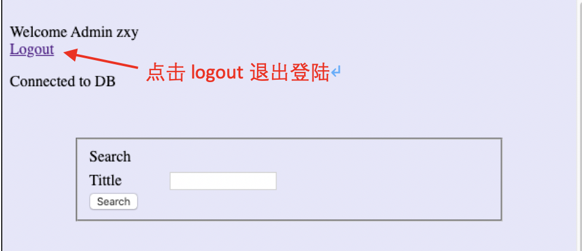
  
#### 管理员微博管理
1. 页面介绍：
  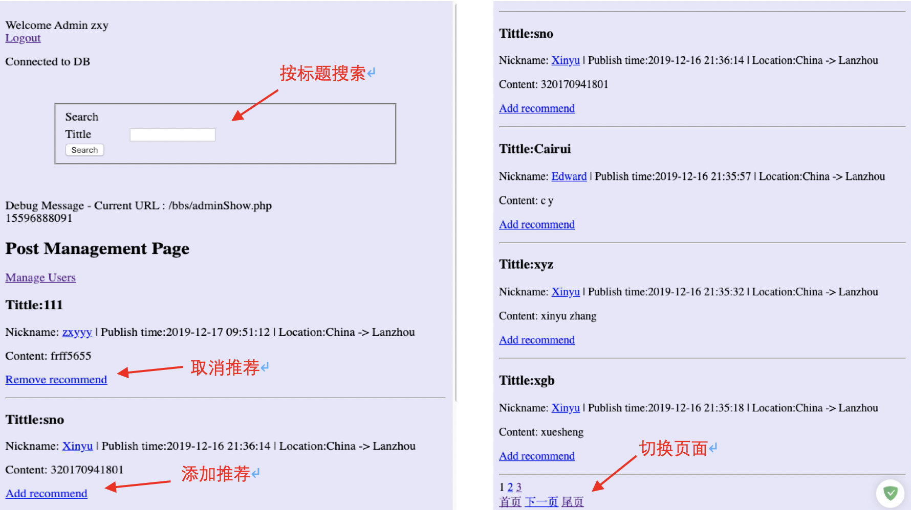
2. 微博内容介绍
  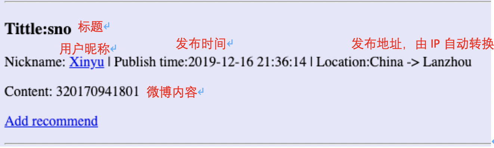
3. 设置推荐
   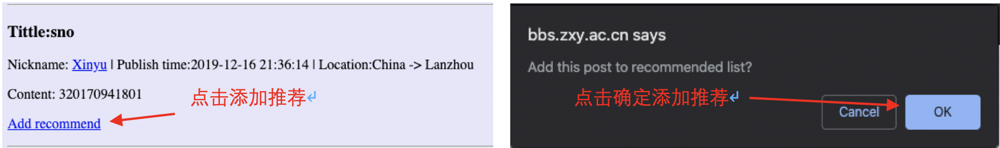
4. 取消推荐 
   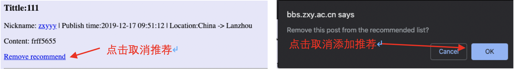

#### 管理员用户管理
1.	切换管理用户的界面，点击`Manage Users`切换管理用户界面:
  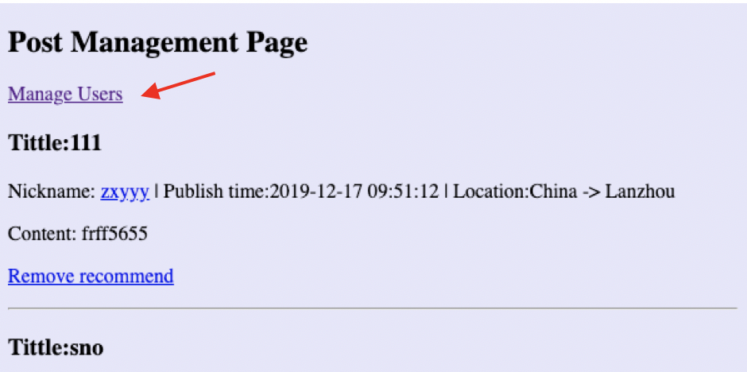
2. 界面介绍:
   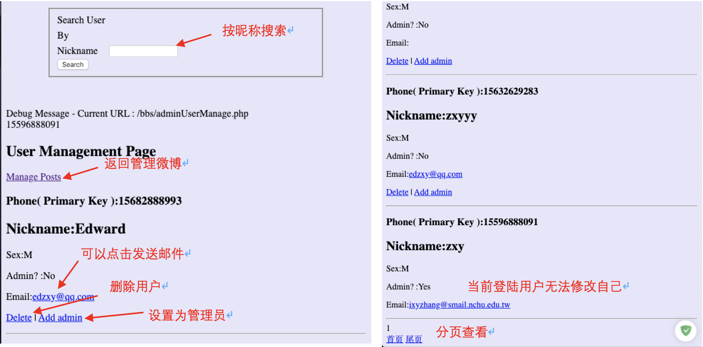
3. 删除用户，点击delete删除用户及其所谓发布的微博，点击点击弹窗中的OK确定删除:
   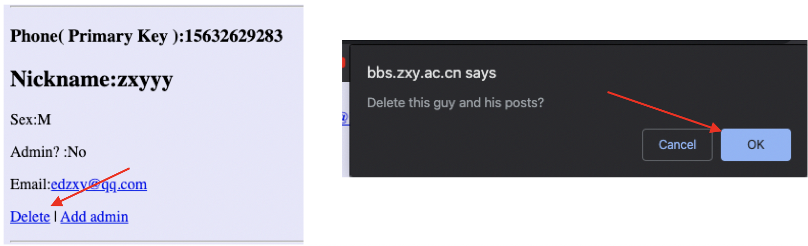
4.	设置、取消管理员。点击Add/Remove admin并点击确定设置取消管理员:
  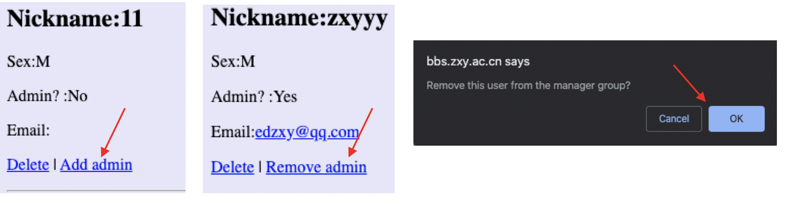

#### 微博发布
1.	推荐微博。普通用户刚登陆后默认显示推荐微博，如果是自己发布的微博可以编辑删除:
  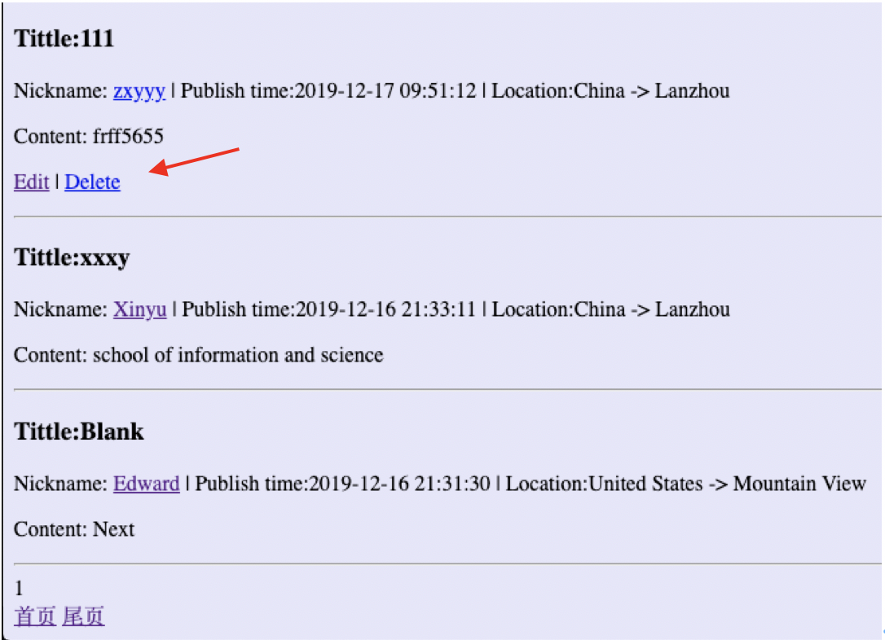
2. 微博发布。输入标题和微博内容后，点击post可以发布新的微博。微博发布后自动返回，查看自己发布的所有微博:
   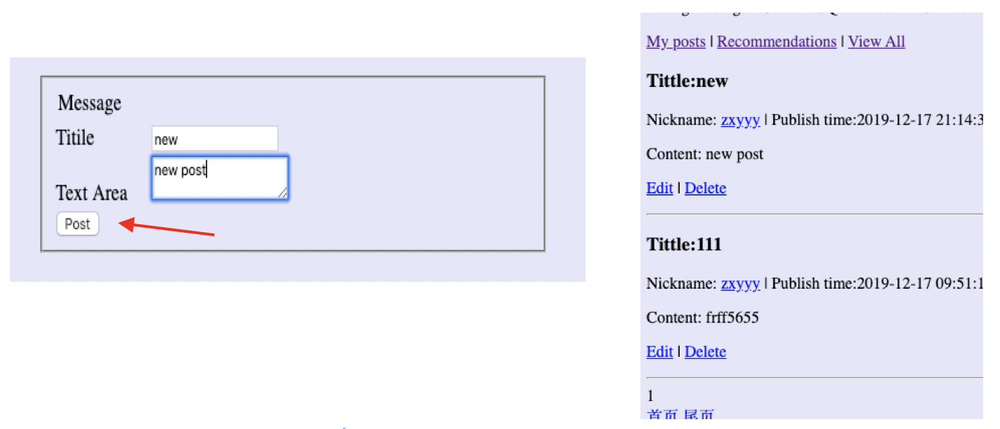
  
#### 微博查看
1.	推荐微博查看。登陆后默认显示推荐微博，在其他页面时点击Recommendations查看推荐微博:
    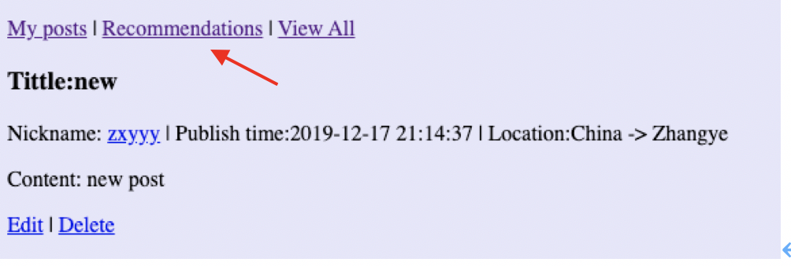
2.	查看自己发布的所有微博。在页面点击My posts查看自己发布的所有微博:
    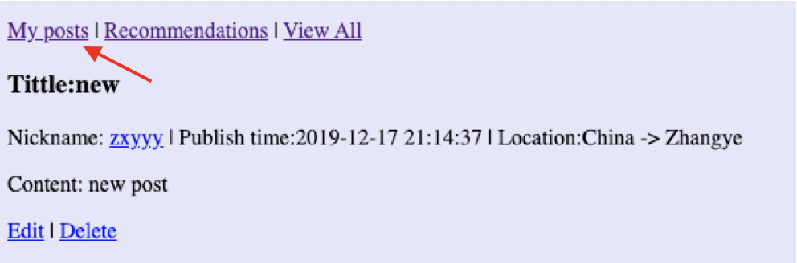
3.	查看所有用户微博。在页面点击View all查看所有用户的微博:
    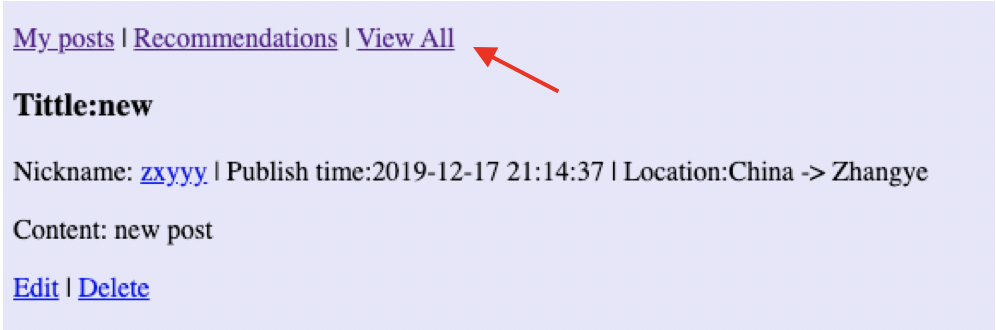
4.	查看特定用户的微博。在查看微博的页面点击任意用户的昵称，查看那个用户发的微博:
    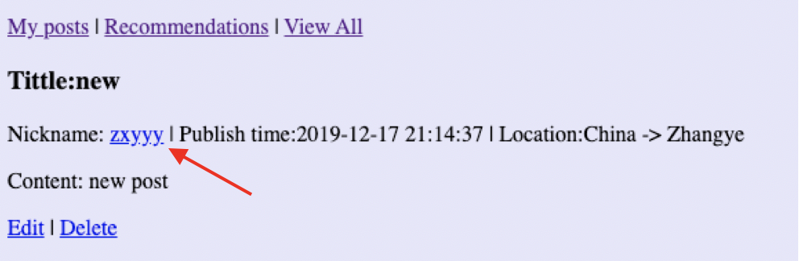
5.	搜索特定的微博。在搜索栏中输入关键字，可以按标题搜索，显示满足搜索关键字的微博:
    
  
#### 微博编辑
1.	编辑微博。在任意微博显示页面，只要是自己发布的微博都可以编辑，点击edit进行编辑:
    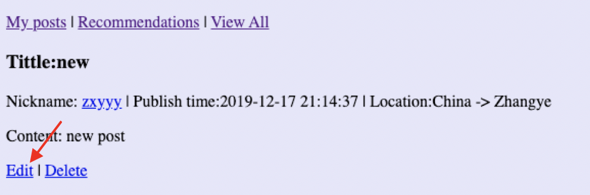
2.	完成编辑。在跳转的页面中完成新微博内容的编辑，点击post完成修改:
    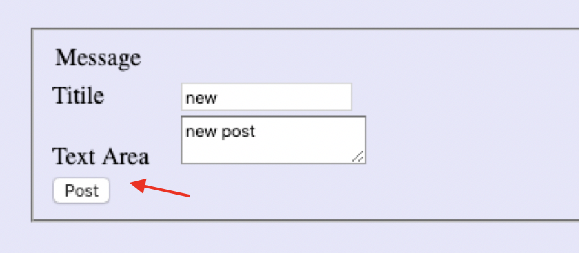
3.	修改后默认返回修改前的页面
  

### 亮点
1. **注册页面向手机发送SMS code**
2. 普通用户/管理员进行了对内容或用户的编辑操作后返回原页面
3. **通过获取登录用户的IP地址查询其真实地址**

